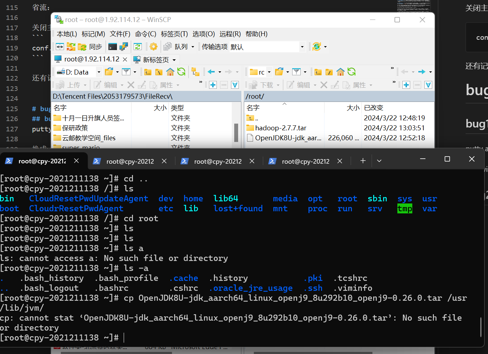
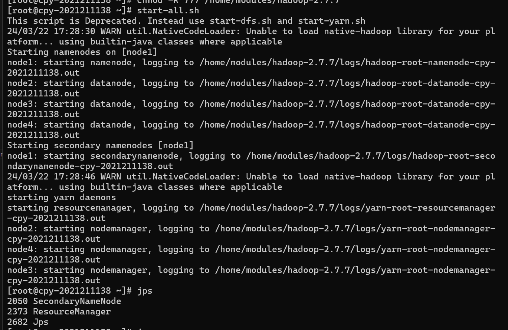
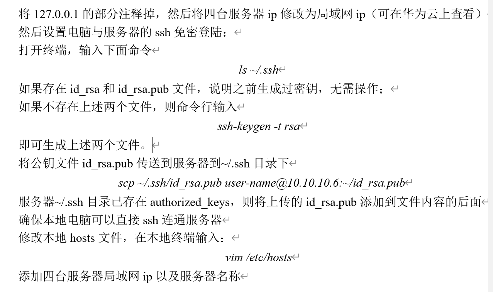

# Bug报告
小组成员：孔德桐、雷玺霖、陈朴炎

报告人：陈朴炎

## bug1
bug:putty access denied

解决方法：换成windows的powershell ，输入ssh root@"ip" ， "ip"为服务器外网ip

## bug2
用WinSCP传入的两个文件夹都在node1里找不到


关机重启当前服务器，才能看到

## bug3
主节点运行 start-all.sh 之后，显示namenode写入log，但是输入jps命令之后却没有显示出namenode


原来是我忘记执行上一条命令 hadoop namenode -format ，重新执行后，再start-all.sh，jps输出结果就符合预期

## bug4
5W{R7.png)
上传文件的时候告诉我可用结点个数为0

出错原因分析：

这部分没有做好，重新做了一遍\
是因为我没有在windows上安装vim，并且当时ls指令它没有匹配到报错了\
而且找不到/etc/hosts 就跳过了\
后来发现它在C/Windows/System32/drivers/etc/hosts 下面\
找到了但是改不了\
用VSCode打开->用管理员权限更改就行了\
最后成功了

## bug5
$F9W_{_~@BG)SDM]P@PNY.png>)
不理解host文件中的配置信息以及作用

解决：host这个东西你可以理解为本地的DNS解析，就是最终还是会解析成ip地址的，这个一个ip对应两个名字，就是这两个名字都能解析成前面这个ip


## bug6
配置免密登录的时候，总是失败。可以添加-vvv来打印ssh调试信息。最后发现一切正常，错误是因为复制的时候，vim会吞掉第一个字符，不知道为什么。

## bug7
```
[root@lxl-2021211146-0002 ~]# hadoop namenode -format
DEPRECATED: Use of this script to execute hdfs command is deprecated.
Instead use the hdfs command for it.

/home/modules/hadoop-2.7.7/bin/hdfs: line 304: /usr/lib/jvm/jdk8u292-b10/bin/java: No such file or directory
```
cd /usr/lib/
rm -rf jvm
mkdir jvm

scp OpenJDK8U-jdk_aarch64_linux_openj9_8u292b10_openj9-0.26.0.tar  root@1.92.137.22:/root/download
scp OpenJDK8U-jdk_aarch64_linux_openj9_8u292b10_openj9-0.26.0.tar  root@124.70.57.108:/root/download
scp OpenJDK8U-jdk_aarch64_linux_openj9_8u292b10_openj9-0.26.0.tar  root@1.92.139.33:/root/download
scp OpenJDK8U-jdk_aarch64_linux_openj9_8u292b10_openj9-0.26.0.tar  root@1.92.124.93:/root/download

mv /root/download/OpenJDK8U-jdk_aarch64_linux_openj9_8u292b10_openj9-0.26.0.tar /usr/lib/jvm/

cd /usr/lib/jvm/
tar -vxf OpenJDK8U-jdk_aarch64_linux_openj9_8u292b10_openj9-0.26.0.tar

## bug8
```
start-all.sh
starting resourcemanager, logging to /home/modules/hadoop-2.7.7/logs/yarn-root-resourcemanager-lxl-2021211146-0002.out
node3: Error: JAVA_HOME is not set and could not be found.
node1: Error: JAVA_HOME is not set and could not be found.
node4: Error: JAVA_HOME is not set and could not be found.
```
JAVA_HOME is not set and could not be found

在JDK配置无错的情况下，可能是没有配置hadoop-env.sh文件。这个文件里写的是hadoop的环境变量,主要修改hadoop的JAVA_HOME路径。

切到 [hadoop]/etc/hadoop目录
执行：vim hadoop-env.sh
修改java_home路径和hadoop_conf_dir路径为具体的安装路径
例如：
export JAVA_HOME=/usr/jdk1.8.0_65
export HADOOP_CONF_DIR=/usr/hadoop-3.1.3/etc/hadoop
重新加载使修改生效：source hadoop-env.sh

vim /home/modules/hadoop-2.7.7/etc/hadoop/hadoop-env.sh

## bug9
```
can't find module
Could not find artifact arg.apache.hadoop:hadoop-common:pom:2.7.7 in central (https://repo.maven.apache.org/maven2)
```
mave->reload project

maven下载dependency失败

发现应该是打字打错了

正确配置如下
```xml
<dependencies>
        <dependency>
            <groupId>log4j</groupId>
            <artifactId>log4j</artifactId>
            <version>1.2.17</version>
        </dependency>
        <dependency>
            <groupId>org.apache.hadoop</groupId>
            <artifactId>hadoop-client</artifactId>
            <version>${hadoop.version}</version>
        </dependency>
        <dependency>
            <groupId>org.apache.hadoop</groupId>
            <artifactId>hadoop-common</artifactId>
            <version>${hadoop.version}</version>
        </dependency>
        <dependency>
            <groupId>org.apache.hadoop</groupId>
            <artifactId>hadoop-hdfs</artifactId>
            <version>${hadoop.version}</version>
        </dependency>
```

## bug10
```
org.apache.hadoop.ipc.RemoteException(java.io.IOException): File /2021211146.txt could only be replicated to 0 nodes instead of minReplication (=1).  There are 3 datanode(s) running and 3 node(s) are excluded in this operation.
```

要查看 HDFS 是否正常工作，你可以采取以下几种方法来检查：

1. **HDFS Web UI：** 通过浏览器访问 HDFS 的 Web 用户界面可以获取有关 HDFS 集群健康状态的信息。通常，你可以通过以下地址访问 HDFS Web UI：
   - NameNode Web UI：`http://<namenode_hostname>:50070` 或 `http://<namenode_hostname>:9870`
   - DataNode Web UI：`http://<datanode_hostname>:50075`

2. **HDFS fsck 命令：** 在命令行中运行 `hdfs fsck /` 命令，可以对整个 HDFS 文件系统进行一致性检查，并获取有关块位置、副本数量等信息。

3. **JMX 监控：** 通过 JMX（Java Management Extensions）可以监控 HDFS 的运行状况。你可以使用 JMX 工具（如 JConsole 或 JVisualVM）连接到 NameNode 或 DataNode 进程，以检查各个组件的运行状态。

4. **日志文件：** 查看 HDFS 的日志文件可以帮助你了解系统运行过程中的任何错误或警告信息。通常，HDFS 的日志文件位于 `logs` 目录中，你可以检查这些日志文件来查看集群的运行情况。

通过以上几种方法，你可以监控 HDFS 的健康状态、文件系统一致性以及集群各组件的运行状况。如果发现任何异常情况，你就可以更快地解决问题并恢复 HDFS 的正常工作状态。祝你顺利！🚀🔍

conf.set("dfs.client.use.datanode.hostname", "false");

当设置为false时："dfs.client.use.datanode.hostname= false" Hadoop 客户端会使用 DataNode 的 IP 地址而不是主机名与 DataNode 通信。这意味着客户端会使用 DataNode 上报的 IP 地址进行通信，而不会依赖于主机名。

而当设置为true时： "dfs.client.use.datanode.hostname=true"，Hadoop 客户端将使用 DataNode 的主机名而不是 IP 地址与 DataNode 进行通信。这意味着客户端会使用 DataNode 主机名进行通信，这有助于在集群中更好地使用主机名进行通信，而不仅仅依赖于 IP 地址。这种设置更有利于集群环境的稳定性和可靠性，因为主机名更不容易发生变化。

因此，"dfs.client.use.datanode.hostname=false" 和 "dfs.client.use.datanode.hostname=true" 的区别主要在于客户端与 DataNode 进行通信时使用的是 IP 地址还是主机名。选择哪种设置取决于你的环境和需求，但通常建议使用主机名来提高稳定性和可维护性。希望这能帮助理解两者之间的区别！🔧🧐

notepad C:\Windows\System32\drivers\etc\hosts

ipconfig /flushdns

省流：

关闭主机名解析模式，使用IP解析
```
conf.set("dfs.client.use.datanode.hostname", "false");
```

还有记得安全组中添加50010端口开放，否则无法解析datanode

## bug11
Bug：连续format两次之后，slave和master不能通信，slave没有datanode进程；


解决方法：删除所有节点的hadoop.tmp.dir配置中的目录中的文件 重新format

